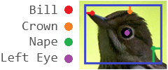
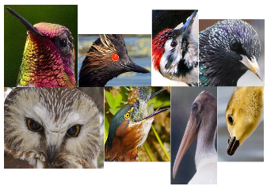
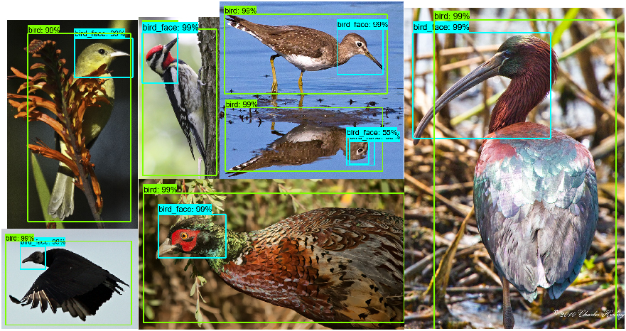

# NABirds
Organizing the NABirds dataset and constructing bounding box labels for bird faces using key points. These were then used to train deep models for bird body and face detection.

Application: [Knest](https://github.com/adcrn/knest) 
[Dataset Source](http://dl.allaboutbirds.org/nabirds) 

## Face Dataset
- NABirds contains 48562 birds, bounding boxes and 11 body parts locations along with species identification
- 46824 were selected, ~1700 contained bad facial features or too small
- ~334 mislabeled parts or incorrect bounding boxes corrected
	* more probably exist that have gone unnoticed
- From these images face BBs were constructed
	* using 5 body parts (x,y) associated with the head
		+ bill, crown, nape, left and right eye
	* These x,y used to determine orientation or direction facing
		+ 10 orientations considered 
			- such as facing left, right, down, up, upsidedown, toward camera, body parts above or below 
				others
			- along with missing parts, no crown or nape, one or both eyes
	* ratio of body part distance used to determine extra space around parts for box
		+ helped prevent BB becoming cross section of the face
		+ image size taken into account to prevent extending beyond
- all BBs were tested for errors and cropped from each image to confirm correct size
- these images were split into 38,824 training images and 8,000 test images

*Knest Won best Computer Science project for Florida's Spring 2018 Senior Design Fair  
Examples from Knest's object detection model:

